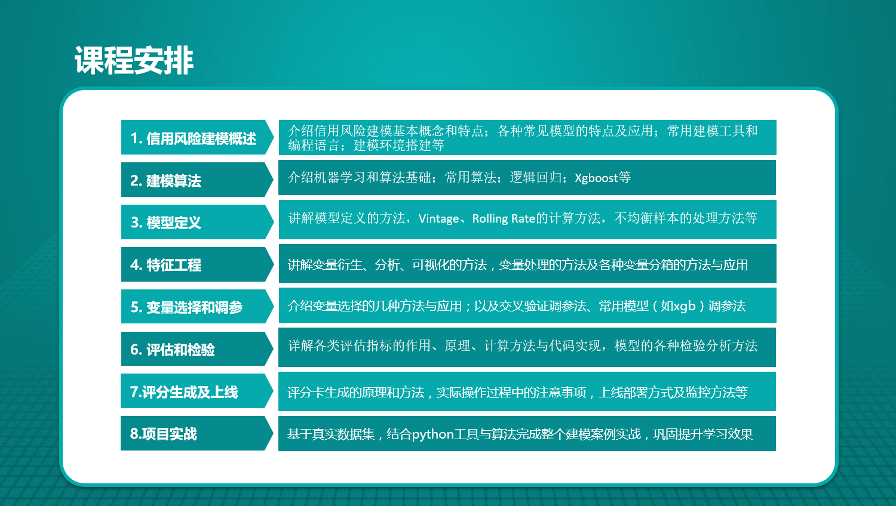
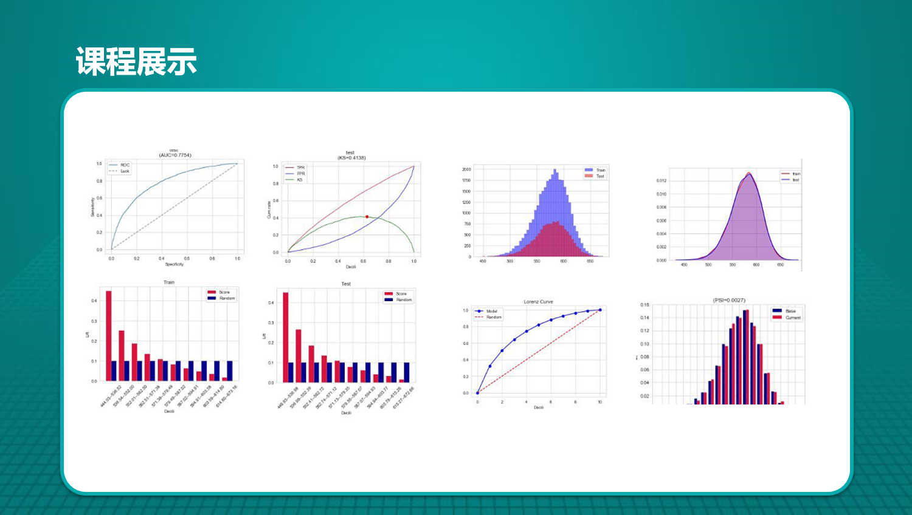

# XXDScorecard

# 安装

pip install XXDScorecard

# 使用

scorecard developing utilities.

import  XXDScorecard.XXDBinning as binning

from sklearn.model_selection import train_test_split

df = pd.read_csv('data.csv')

train_df, test_df = train_test_split(df,test_size=0.3,random_state=100,stratify=df.flgGood)

# 数值型
nb = binning.XXDNumberBin()

## 1. 数值型等频分箱

nb.pct_bin(train_df,'req_inc_ratio','flgGood',max_bin=10)

## 2. 分箱结果

nb.get_bin_stats()

## 3. WOE图

nb.plot_woe()

## 4. 测试集转woe

nb.trans_to_woe(test_df['req_inc_ratio'])

## 5. 手动调整分箱

nb.manual_bin(train_df,'req_inc_ratio','flgGood',[20,30,40])

## 6. 自动单调分箱

nb.monotone_bin(train_df,'req_inc_ratio','flgGood',max_bin=3)

#  字符型

## 1. 自动分箱

cb = binning.XXDCharBin()

cb.pct_bin(train_df,'name','flgGood')

## 2. woe图
cb.plot_woe()

## 3. 分箱结果
cb.get_bin_stats()

## 4. 字符型手动分箱

cb.manual_bin(train_df,'name','flgGood',[['yuqing','xuxiaodong'],['jack ma'],['yq','dd','xxd','qq']])

## 5. 测试集转woe

cb.trans_to_woe(test_df['name'])

# 更多内容请关注微信公众号

# 如果对建模感兴趣，也可以学习整套[信用风险建模课程](https://study.163.com/course/introduction.htm?share=2&shareId=480000001892725&courseId=1209237822&_trace_c_p_k2_=3f7ef0c8f3764992b04a219db1296258)

